

  

# 🔐 Secure Static Website Hosting on AWS S3

This project documents my end-to-end process of hosting a **secure static website on Amazon S3**, including troubleshooting a real **403 Access Denied** error and implementing correct bucket policies.

The goal was not just to get a website online, but to understand **why each configuration step is required** in a real cloud environment.

---

## 🎯 Project Objectives
- Host a static website using Amazon S3
- Configure public access securely
- Apply and verify bucket policies
- Troubleshoot and resolve 403 Access Denied errors
- Use VS Code for structured frontend development
- Document the process clearly and repeatably

---

## 🛠️ Technologies Used
- Amazon S3
- IAM & S3 Bucket Policies
- HTML, CSS, JavaScript
- Visual Studio Code
- GitHub (documentation & portfolio)

---

## 📂 Step-by-Step Implementation

---

### 1️⃣ Create an S3 Bucket
**Why:**  
An S3 bucket is the foundation of static website hosting. The bucket acts as the container for all website files.

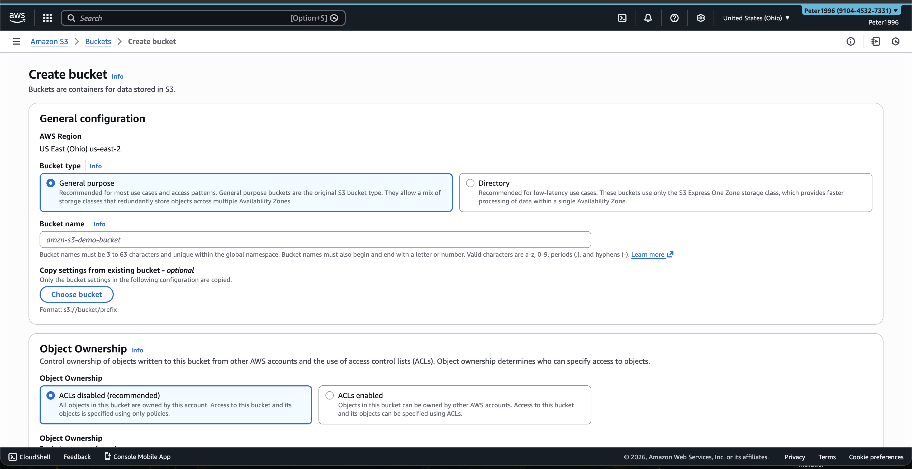

---

### 2️⃣ Enable Public Access
**Why:**  
S3 blocks public access by default. Since this is a public website, public access needed to be explicitly enabled while still controlling permissions through policies.

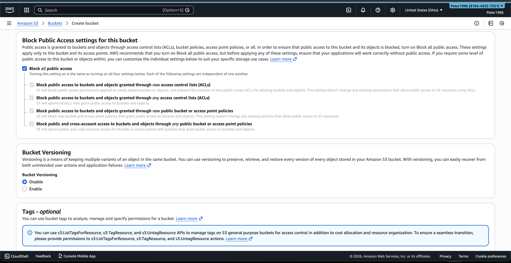

---

### 3️⃣ Confirm Bucket Creation
**Why:**  
Before uploading files or applying configurations, I verified that the bucket was successfully created and available in the AWS console.

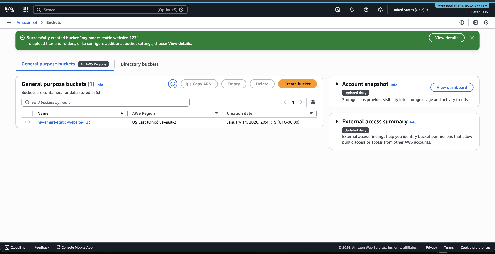

---

### 4️⃣ Upload HTML Files to S3
**Why:**  
Uploading HTML files provides the actual content that will be served to users. Without this step, the bucket exists but serves no web pages.

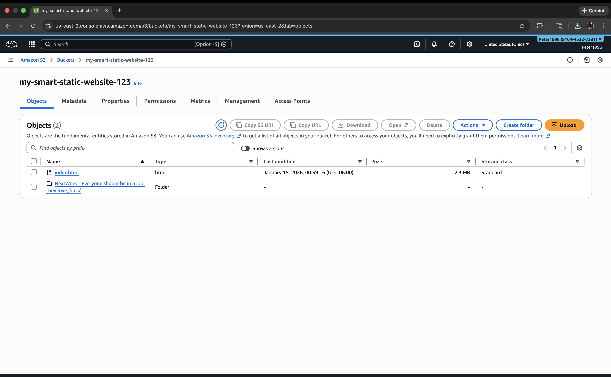

---

### 5️⃣ Enable Static Website Hosting
**Why:**  
S3 does not act as a web server by default. Enabling static website hosting allows the bucket to serve web content through an HTTP endpoint.

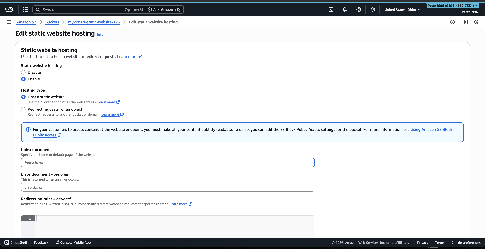

---

### 6️⃣ Configure Bucket Policy Permissions
**Why:**  
Even with public access enabled, S3 requires an explicit bucket policy to allow users to retrieve objects. This step defines access rules clearly and securely.

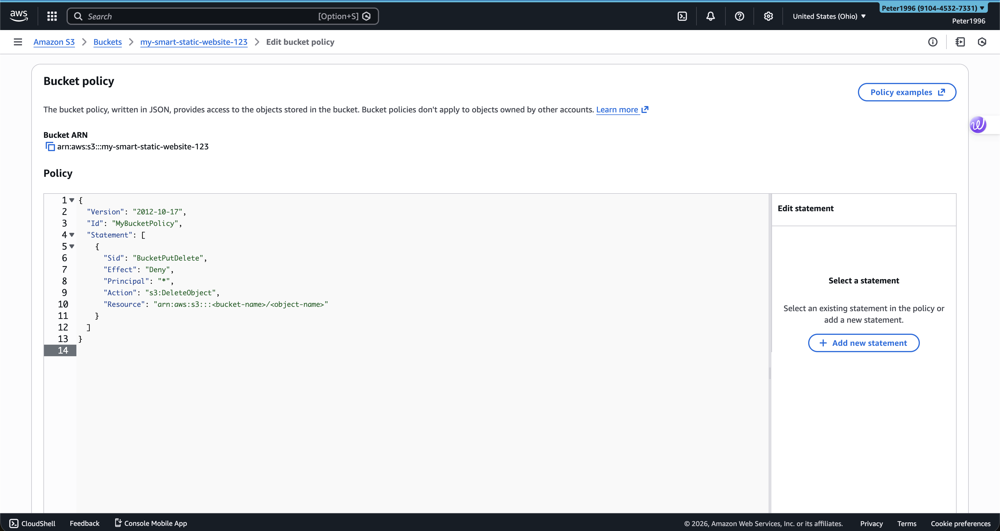

---

### 7️⃣ Troubleshoot 403 Forbidden (Access Denied)
**Why:**  
At this stage, I encountered a real-world **403 Access Denied** error. This is a common issue caused by incorrect permissions or policies and required investigation and correction.

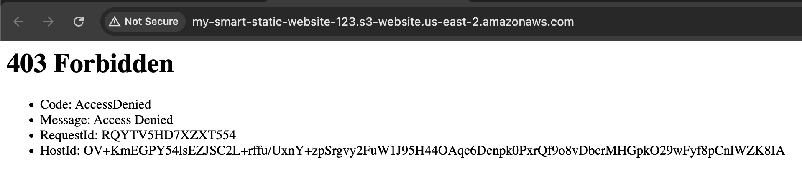

---

### 8️⃣ Final Web Page Success
**Why:**  
After correcting the bucket policy and permissions, the website loaded successfully, confirming that the access issue was fully resolved.

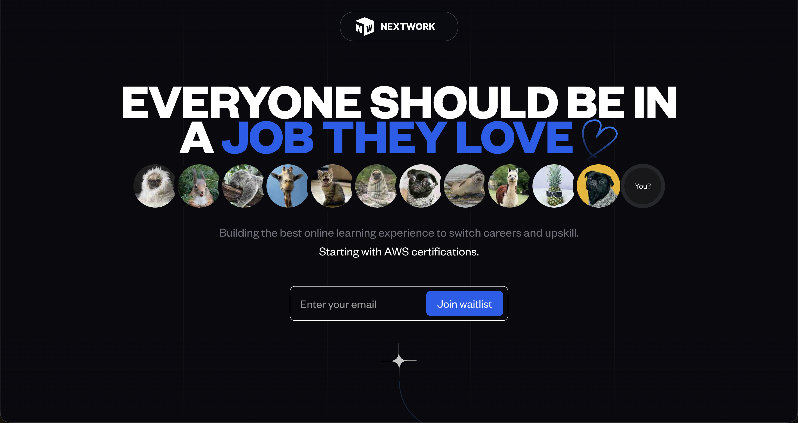

---

### 9️⃣ Verify Bucket Policy Is in Effect
**Why:**  
I verified that the bucket policy was correctly applied and persisted to ensure the solution was stable and not temporary.

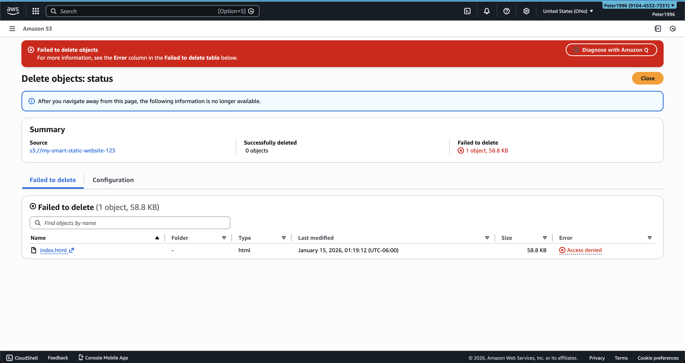

---

### 🔟 Use VS Code for HTML Development
**Why:**  
Using VS Code instead of editing files directly in AWS reflects real-world development workflows and improves code organization and maintainability.

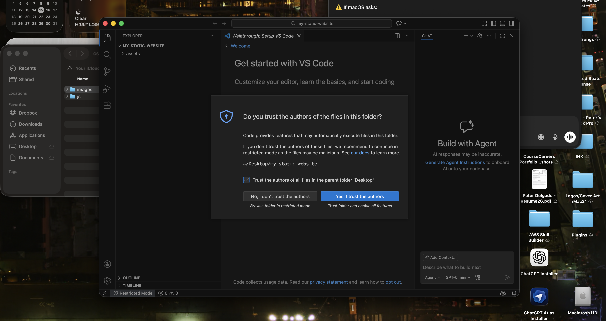

---

### 1️⃣1️⃣ Add JavaScript Files
**Why:**  
Adding JavaScript allowed the project to move beyond basic static HTML and prepared it for dynamic functionality and future expansion.

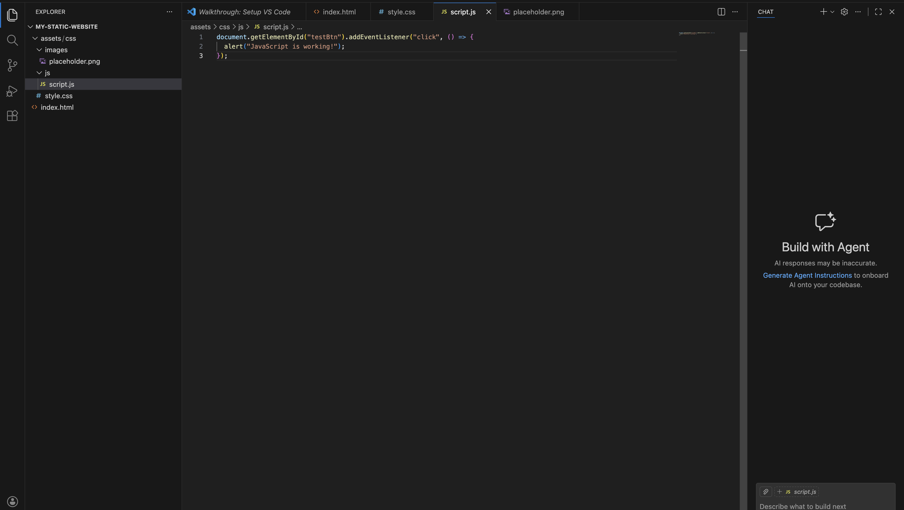

---

### 1️⃣2️⃣ Final Review in VS Code
**Why:**  
A final review ensured the project structure, code quality, and file organization were clean and production-ready.

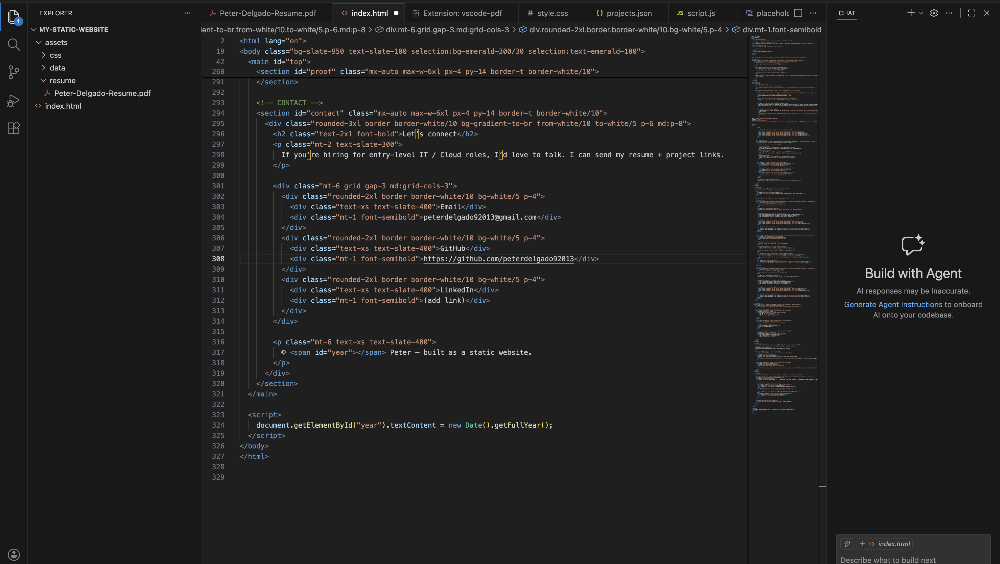

---

## ✅ Key Takeaways
- Learned how Amazon S3 static website hosting works in practice
- Gained hands-on experience troubleshooting 403 Access Denied errors
- Understood the relationship between public access settings and bucket policies
- Practiced clean documentation and repeatable deployment steps

---

## 🔗 Live Demo
_Add your live S3 or GitHub Pages URL here_

---

## 📌 Why This Project Matters
This project reflects real cloud engineering scenarios:
- Misconfigurations happen
- Permissions must be explicit
- Troubleshooting is part of deployment
- Documentation is critical for repeatability

---

## 👤 Author
**Peter Delgado**  
Entry-Level Cloud / IT | AWS | Azure | Networking
